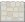

# Classic Arcade Game Clone Project

## Table of Contents

- [Description](#description)
- [Instructions](#instructions)

## Description
This arcade game was made for Udacity Frontend Nanodegree Program.
We were given a GitHub base project to start with.

## Instructions

For better instructions guidance, in the next table we show images for in game objects:

Image       |   Description
------------|---------------
 | Player
 | Enemy
 | Heart
 | Grass Area
 | Stone Area
 | Green Gem
 | Blue Gem
 | Orange Gem
 | Star

### Starting game
The game starts with the player located in the grass area.
A player has initially five hearts for his life.

### How to Play
In the stone area there are enemies moving from one side the other.
The player is given a limited time to catch gems, stars or hearts in the stone area of the game, while avoiding enemies.
In order to move in game, the player can use the up, down, left and right arrows of keyboard.
If one enemy catches the player, he will lose a heart of his life and be moved to the initial position where he started the game.

### Rewards
- player catches a gem: the scoreboard is increased.
- player catches a star: the game time limit increases.
- player catches a heart: player life increases in one heart if it's not in the maximum amount of five.

### Game ending conditions
- Time limit reaches zero;
- Player loses all hearts of his life;
- Scoreboard reach the maximum of 100 points.